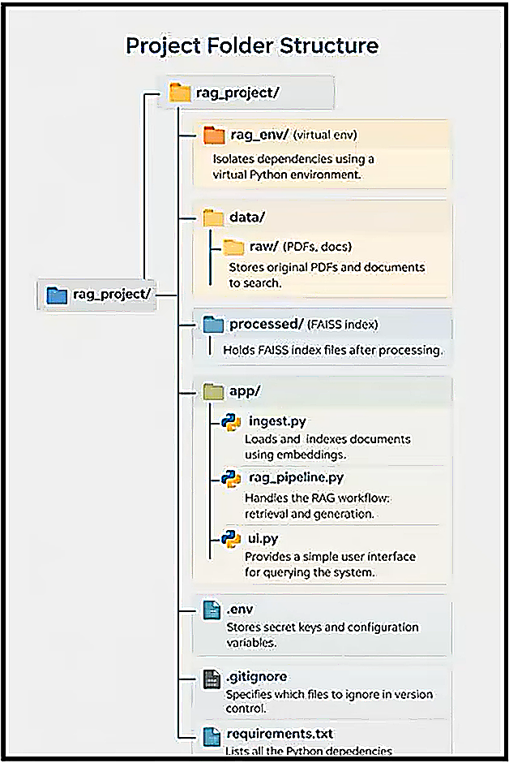

# $\text{Retrieval-Augmented Generation}$

**Retrieval-Augmented Generation (RAG)** is an approach in artificial intelligence that combines retrieving information from external sources with a language model’s ability to generate text, enabling more accurate, relevant, and knowledge-grounded responses.

## $\text{RAG Project Folder Structure}$

  

## $\text{References}$
Simplilearn. (2026). Python RAG Tutorial 2026 | Build AI Apps with RAG (Retrieval Augmented Generation). YouTube. https://youtu.be/WQTaM7tBlvc